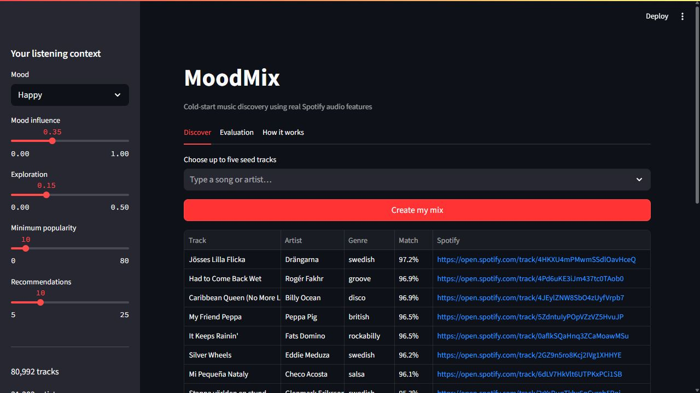
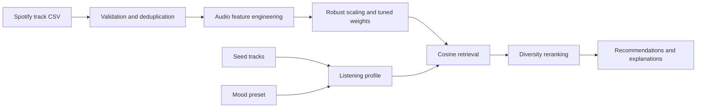

# MoodMix

MoodMix is a cold-start, mood-aware music recommender built from real Spotify
audio features. A new listener can start with up to five seed tracks, a mood, or
both. Tracks are ranked by weighted audio similarity and reranked to reduce
repetition—no listening history or account is required.



## Contents

- [Why this project exists](#why-this-project-exists)
- [Features](#features)
- [Dataset](#dataset)
- [How it works](#how-it-works)
- [Evaluation](#evaluation)
- [Installation and reproduction](#installation-and-reproduction)
- [Using the demo](#using-the-demo)
- [Project structure](#project-structure)
- [Tests](#tests)
- [Limitations](#limitations)
- [Troubleshooting](#troubleshooting)
- [Future work](#future-work)
- [Data usage and attribution](#data-usage-and-attribution)

## Why this project exists

Collaborative recommenders need interaction history and perform poorly for new
users and new items. MoodMix explores the complementary cold-start question:

> How well can audio characteristics alone retrieve relevant music when the
> query track has never appeared in the recommendation catalog?

The project intentionally stays content-based. Its goal is to make that approach
careful, measurable, reproducible, and useful—not to imitate Spotify's production
recommendation system.

The maintained implementation is the `moodmix` package under `src/`.

## Features

- Real, pre-collected Spotify audio descriptors
- Dataset validation and canonical artist/title deduplication
- Robust scaling that reduces sensitivity to outliers
- Cyclic musical-key encoding, so B is close to C
- Weighted cosine similarity over audio embeddings
- Seed-track listening profiles
- Five interpretable mood presets
- Adjustable seed-versus-mood influence
- Diversity-aware reranking and repeated-artist penalties
- Per-track explanations based on original audio properties
- Popularity and unweighted-cosine baselines
- Validation-only feature-weight tuning
- Disjoint cold-track test evaluation
- Interactive Streamlit demo with Spotify links and evaluation charts

Popularity and genre are deliberately excluded from the similarity embedding.
Popularity remains an honest baseline, while genre remains an external relevance
label for offline evaluation.

## Dataset

The source dataset contains 114,000 rows of Spotify metadata and audio features.
Validation, range checks, Spotify-ID deduplication, and normalized artist/title
deduplication produce:

| Statistic | Clean catalog |
|---|---:|
| Tracks | 80,992 |
| Artists | 31,383 |
| Genres | 113 |

The download script uses a Hugging Face mirror of Maharshi Pandya's Spotify
Tracks Dataset:

- Mirror: <https://huggingface.co/datasets/sfiore/spotify-tracks-dataset>
- Original: <https://www.kaggle.com/datasets/maharshipandya/spotify-tracks-dataset>

The files contain previously collected Spotify API values; MoodMix does not call
Spotify's API. Raw and processed CSV files are excluded from version control.

### Model inputs

| Group | Features | Treatment |
|---|---|---|
| Mood | `energy`, `valence` | Robust scaling and tuned weighting |
| Rhythm | `danceability`, `tempo`, `loudness` | Log tempo, robust scaling |
| Texture | `acousticness`, `instrumentalness`, `speechiness` | Robust scaling |
| Context | `liveness`, `duration_ms` | Log duration, robust scaling |
| Tonal | `key`, `mode`, `time_signature` | Cyclic key encoding |

The following source fields are not model inputs:

- `track_genre`: evaluation relevance label only
- `popularity`: baseline and optional UI candidate filter only
- Track, artist, and album names: display and deduplication only

## How it works



### 1. Audio embedding

Each track is transformed into an engineered feature vector, robustly scaled,
multiplied by the square root of its learned weight, and L2-normalized:

```text
embedding(track) = normalize(robust_scale(features(track)) * sqrt(weights))
```

Taking the square root makes the configured value act as the feature's weight in
the underlying weighted distance.

### 2. Seed and mood profiles

The seed profile is the normalized mean embedding of the selected tracks. A mood
is represented by a neutral catalog row whose relevant properties are replaced
with the preset targets. When both are present:

```text
profile = normalize((1 - mood_strength) * seed_profile
                    + mood_strength * mood_profile)
```

Mood presets are interpretable valence-energy targets, not clinical or universal
emotion labels:

| Mood | Main target characteristics |
|---|---|
| Happy | High valence, moderately high energy and danceability |
| Energetic | Very high energy, high danceability, low acousticness |
| Calm | Low energy, moderate valence, high acousticness |
| Melancholic | Low valence, low-to-moderate energy, higher acousticness |
| Focused | Moderate energy, low speechiness, high instrumentalness |

### 3. Retrieval and reranking

Initial relevance is cosine similarity:

```text
relevance(track) = cosine(profile, embedding(track))
```

The top candidate pool is reranked greedily using maximal marginal relevance:

```text
objective = relevance
            - exploration * max_similarity_to_selected_tracks
            - repeated_artist_penalty
```

The input tracks are excluded. Results also contain a compact explanation such
as “Similar energy and tempo; matches energetic valence.” Explanations describe
feature proximity; they are not causal claims.

### 4. Weight selection

The hand-weighted configuration emphasizes energy and valence while limiting
noisy dimensions such as time signature. A deterministic search changes five
interpretable feature-group multipliers. The configuration with the highest
validation NDCG@10 is saved to `artifacts/tuned_weights.json`; the Streamlit app
loads it automatically.

## Evaluation

### Protocol

The benchmark uses a fixed random seed and a genre-stratified 70/15/15 split:

- 70% candidate catalog
- 15% validation-query pool, used only for weight selection
- 15% untouched test-query pool, used only for final reporting

Every query track is absent from the candidate catalog, making this a cold-track
retrieval test. Twelve feature-group configurations are compared on 250 sampled
validation queries. The final comparison uses 500 sampled test queries.

A recommended track is considered relevant when it has the same genre as the
query. Genre is never included in the embedding. This measures audio–genre
coherence, not personalized satisfaction.

### Metrics

- **Precision@10:** fraction of the ten results that are relevant
- **Recall@10:** fraction of all relevant catalog tracks retrieved
- **NDCG@10:** ranking quality with more credit for early relevant results
- **Catalog coverage:** fraction of candidate tracks recommended at least once
- **Artist diversity:** mean fraction of unique artists within each result list

### Final untouched-test results

| Model | Precision@10 | Recall@10 | NDCG@10 | Coverage | Artist diversity |
|---|---:|---:|---:|---:|---:|
| Popularity | 0.0074 | 0.0003 | 0.0078 | 0.0002 | 0.7000 |
| Unweighted cosine | 0.1044 | 0.0018 | 0.1119 | 0.0843 | **0.9792** |
| Hand-weighted cosine | 0.1102 | **0.0019** | 0.1145 | **0.0842** | 0.9720 |
| Validation-tuned cosine | **0.1120** | **0.0019** | **0.1167** | 0.0840 | 0.9724 |

The tuned model improves Precision@10 by 7.3% and NDCG@10 by 4.3% over
unweighted cosine on unseen test queries. Recall is numerically small because a
genre may contain hundreds of relevant candidates while each list contains only
ten tracks. Tuning slightly improves ranking relevance while retaining broad
coverage and roughly 9.7 unique artists per ten recommendations.

Generated artifacts:

- `artifacts/evaluation.json`: final test comparison
- `artifacts/tuning_results.json`: validation trials
- `artifacts/tuned_weights.json`: selected feature weights

## Installation and reproduction

### Prerequisites

- Python 3.10 or later
- Approximately 250 MB of free space for the environment and data
- Internet access for the one-time dataset download

Commands below are shown for Windows PowerShell from the project directory.

### 1. Create an environment

```powershell
python -m venv .venv
.venv\Scripts\Activate.ps1
python -m pip install --upgrade pip
python -m pip install -r requirements.txt
```

### 2. Download and prepare the catalog

```powershell
python scripts/download_data.py
python scripts/prepare_data.py
```

Expected preparation summary:

```text
{'tracks': 80992, 'artists': 31383, 'genres': 113, ...}
```

### 3. Reproduce tuning and final evaluation

```powershell
python scripts/evaluate.py --queries 500 --validation-queries 250 --trials 12 --k 10
```

The benchmark rewrites the three JSON artifacts listed above. With the same data,
arguments, library behavior, and random seed, it is deterministic.

### 4. Run the tests

```powershell
python -m pytest -q
```

### 5. Launch the demo

```powershell
python -m streamlit run app/streamlit_app.py
```

Open <http://localhost:8501> if Streamlit does not open it automatically.

## Using the demo

1. Select zero to five seed tracks. Leaving this empty demonstrates new-user
   cold start using mood alone.
2. Choose a mood preset.
3. Set **Mood influence** to control seed-versus-mood blending.
4. Set **Exploration** to control similarity-versus-variety reranking.
5. Optionally exclude very obscure tracks using **Minimum popularity**.
6. Select **Create my mix**.

The **Evaluation** tab shows the saved metrics, and **How it works** summarizes
the ranking pipeline. Spotify links open the corresponding public track pages.

## Project structure

```text
Music Recommendation System/
├── app/
│   └── streamlit_app.py       # Interactive demo
├── artifacts/
│   ├── evaluation.json        # Final test results
│   ├── tuned_weights.json     # Validation-selected weights
│   └── tuning_results.json    # Validation trial metrics
├── data/
│   ├── raw/                   # Downloaded source CSV, not versioned
│   └── processed/             # Validated catalog, not versioned
├── docs/
│   └── moodmix-demo.png       # README screenshot
├── scripts/
│   ├── download_data.py       # Reproducible dataset download
│   ├── prepare_data.py        # Validation and deduplication
│   └── evaluate.py            # Tuning and test benchmark
├── src/moodmix/
│   ├── config.py              # Feature weights and mood targets
│   ├── data.py                # Dataset contract and cleaning
│   ├── evaluation.py          # Splits, metrics, tuning, baselines
│   ├── features.py            # Feature engineering and embeddings
│   └── recommender.py         # Retrieval, reranking, explanations
├── tests/                     # Unit and regression tests
├── pyproject.toml             # Package metadata and test configuration
├── requirements.txt           # Runtime and test dependencies
└── README.md
```

## Tests

The test suite currently covers:

- Schema validation and canonical deduplication
- Cyclic key encoding
- Seed exclusion and nearest-track behavior
- Mood-only cold-start recommendations
- Recommendation explanations
- Ranking metric behavior

Run it with:

```powershell
python -m pytest -q
```

## Limitations

- Genre agreement is only a proxy for relevance; it does not measure individual
  listener satisfaction.
- Genre labels can be broad, overlapping, or noisy, and each deduplicated track
  retains one source genre.
- Mood presets are engineering heuristics derived from audio descriptors, not
  ground-truth emotion annotations.
- The source is a static, third-party snapshot and may contain stale Spotify
  metadata.
- Audio similarity cannot capture lyrics, cultural context, novelty preference,
  or the full meaning of a song.
- Popularity filtering can improve perceived familiarity but may reduce discovery
  and catalog fairness.
- Explanations report feature proximity and should not be interpreted causally.
- The full embedding matrix is held in memory; this design is appropriate for
  the current catalog but not millions of tracks.
- The demo has no accounts, persistent feedback, production API, or access
  controls.

## Troubleshooting

### Dataset not found

Run both data steps from the repository root:

```powershell
python scripts/download_data.py
python scripts/prepare_data.py
```

### `streamlit` is not recognized

Use the module form, which does not depend on the executable being on `PATH`:

```powershell
python -m streamlit run app/streamlit_app.py
```

### Port 8501 is already in use

Either stop the existing Streamlit process with `Ctrl+C` or choose another port:

```powershell
python -m streamlit run app/streamlit_app.py --server.port 8502
```

### App still shows old evaluation results

After rerunning evaluation, restart Streamlit or clear its cache from the app menu
so the tuned model and JSON artifacts are reloaded.

### Evaluation is slow

Use fewer validation trials and queries for a development smoke test:

```powershell
python scripts/evaluate.py --queries 100 --validation-queries 75 --trials 4 --k 10
```

Do not report those reduced-run metrics as the final benchmark.

## Future work

- Evaluate against real playlist membership or listener feedback
- Learn a similarity metric rather than tuning grouped scalar weights
- Add calibrated novelty and popularity-bias analysis
- Use approximate nearest-neighbor search for a much larger catalog
- Conduct a small user study of mood relevance and explanations
- Add deployment configuration after choosing a hosting target

These are optional research directions; they are not required for the current
content-based cold-start scope.

## Data usage and attribution

The source data is not authored by this project and is not redistributed through
the codebase. The Hugging Face mirror identifies the dataset as BSD and attributes
the original Kaggle dataset, but downstream users should review both upstream
pages and Spotify's applicable terms before redistributing data or using it
commercially.

The project code does not currently declare an open-source license. Add an
explicit code license before publishing or accepting external contributions.

Spotify is a trademark of Spotify AB. This project is an independent educational
work and is not affiliated with or endorsed by Spotify.
